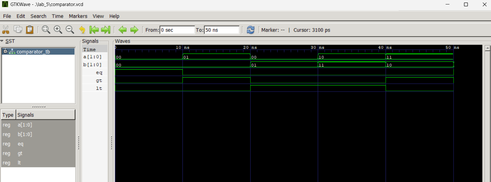

# Lab 5: Multiplexer, Demultiplexer, and 2-Bit Comparator in VHDL

## Objective

The objective of this lab is to design and simulate three combinational logic circuits using VHDL:
1. A **4-to-1 Multiplexer (MUX)**
2. A **1-to-4 Demultiplexer (DEMUX)**
3. A **2-Bit Magnitude Comparator**

Each design is implemented using behavioral architecture in VHDL and verified through simulation using GHDL and GTKWave.

---

## Tools Used

- **GHDL** – VHDL simulator for compilation and simulation
- **GTKWave** – Waveform viewer for verifying simulation output
- **Text Editor** – For writing VHDL source and testbench files

---

## Part 1: 4-to-1 Multiplexer (MUX)

### Theory

A 4-to-1 multiplexer selects one of four data inputs (`D0`–`D3`) and routes it to a single output `Y`, based on a 2-bit select signal `S[1:0]`.

| S[1:0] | Output Y |
|--------|----------|
| 00     | D(0)     |
| 01     | D(1)     |
| 10     | D(2)     |
| 11     | D(3)     |

### VHDL Design – `mux_4to1.vhd`

```vhdl
library IEEE;
use IEEE.STD_LOGIC_1164.ALL;

entity MUX_4TO1 is
port (
  D : in std_logic_vector(3 downto 0);  -- 4 data inputs
  S : in std_logic_vector(1 downto 0);  -- 2 select lines
  Y : out std_logic                      -- Output
);
end entity MUX_4TO1;

architecture Behavioral of MUX_4TO1 is
begin
  process(D, S)
  begin
    case S is
      when "00" => Y <= D(0);
      when "01" => Y <= D(1);
      when "10" => Y <= D(2);
      when "11" => Y <= D(3);
      when others => Y <= '0';
    end case;
  end process;
end architecture Behavioral;
```

### Testbench – `mux_tb.vhd`

```vhdl
library IEEE;
use IEEE.STD_LOGIC_1164.ALL;

entity MUX_TB is
end entity MUX_TB;

architecture Simulation of MUX_TB is
  signal D : std_logic_vector(3 downto 0) := "1010";
  signal S : std_logic_vector(1 downto 0) := "00";
  signal Y : std_logic;
begin
  DUT: entity work.MUX_4TO1 port map (D => D, S => S, Y => Y);

  STIMULUS: process
  begin
    -- D = "1010": D3=1, D2=0, D1=1, D0=0
    S <= "00"; wait for 10 ns;  -- Y = D(0) = 0
    S <= "01"; wait for 10 ns;  -- Y = D(1) = 1
    S <= "10"; wait for 10 ns;  -- Y = D(2) = 0
    S <= "11"; wait for 10 ns;  -- Y = D(3) = 1
    wait;
  end process;
end architecture Simulation;
```

### Simulation Commands

```bash
ghdl -a mux_4to1.vhd
ghdl -a mux_tb.vhd
ghdl -e MUX_TB
ghdl -r MUX_TB --vcd=mux.vcd
gtkwave mux.vcd
```

### Simulation Results

With `D = "1010"` (D3=1, D2=0, D1=1, D0=0), the MUX output `Y` cycles through each input as `S` changes:

| Time  | S  | D    | Y (Expected) |
|-------|----|------|--------------|
| 0 ns  | 00 | 1010 | 0 (D0)       |
| 10 ns | 01 | 1010 | 1 (D1)       |
| 20 ns | 10 | 1010 | 0 (D2)       |
| 30 ns | 11 | 1010 | 1 (D3)       |

The waveform confirmed that the MUX correctly routes each data input to the output based on the select lines.

---

## Part 2: 1-to-4 Demultiplexer (DEMUX)

### Theory

A 1-to-4 demultiplexer routes a single data input `D` to one of four outputs `Y[3:0]`, controlled by a 2-bit select signal `S[1:0]`. All other outputs remain `0`.

| S[1:0] | Active Output |
|--------|---------------|
| 00     | Y(0) = D      |
| 01     | Y(1) = D      |
| 10     | Y(2) = D      |
| 11     | Y(3) = D      |

### VHDL Design – `demux_1to4.vhd`

```vhdl
library IEEE;
use IEEE.STD_LOGIC_1164.ALL;

entity DEMUX_1TO4 is
port (
  D : in std_logic;                      -- Data input
  S : in std_logic_vector(1 downto 0);  -- 2 select lines
  Y : out std_logic_vector(3 downto 0)  -- 4 outputs
);
end entity DEMUX_1TO4;

architecture Behavioral of DEMUX_1TO4 is
begin
  process(D, S)
  begin
    Y <= "0000";  -- Default all outputs low
    case S is
      when "00" => Y(0) <= D;
      when "01" => Y(1) <= D;
      when "10" => Y(2) <= D;
      when "11" => Y(3) <= D;
      when others => null;
    end case;
  end process;
end architecture Behavioral;
```

### Testbench – `demux_tb.vhd`

```vhdl
library IEEE;
use IEEE.STD_LOGIC_1164.ALL;

entity DEMUX_TB is
end entity DEMUX_TB;

architecture Simulation of DEMUX_TB is
  signal D : std_logic := '1';
  signal S : std_logic_vector(1 downto 0) := "00";
  signal Y : std_logic_vector(3 downto 0);
begin
  DUT: entity work.DEMUX_1TO4 port map (D => D, S => S, Y => Y);

  STIMULUS: process
  begin
    D <= '1';
    S <= "00"; wait for 10 ns;  -- Y = 0001
    S <= "01"; wait for 10 ns;  -- Y = 0010
    S <= "10"; wait for 10 ns;  -- Y = 0100
    S <= "11"; wait for 10 ns;  -- Y = 1000
    D <= '0';
    S <= "10"; wait for 10 ns;  -- Y = 0000 (D=0 routed to Y2)
    wait;
  end process;
end architecture Simulation;
```

### Simulation Commands

```bash
ghdl -a demux_1to4.vhd
ghdl -a demux_tb.vhd
ghdl -e DEMUX_TB
ghdl -r DEMUX_TB --vcd=demux.vcd
gtkwave demux.vcd
```

### Simulation Results

| Time  | D | S  | Y (Expected) |
|-------|---|----|--------------|
| 0 ns  | 1 | 00 | 0001         |
| 10 ns | 1 | 01 | 0010         |
| 20 ns | 1 | 10 | 0100         |
| 30 ns | 1 | 11 | 1000         |
| 40 ns | 0 | 10 | 0000         |

The waveform verified that the DEMUX correctly routes the data input `D` to the selected output channel, while keeping all other outputs at `0`.

---

## Part 3: 2-Bit Magnitude Comparator

### Theory

A 2-bit magnitude comparator takes two 2-bit inputs `A[1:0]` and `B[1:0]` and produces three output flags:

- **EQ** (`A = B`) — asserted when both inputs are equal
- **GT** (`A > B`) — asserted when A is greater than B
- **LT** (`A < B`) — asserted when A is less than B

The implementation uses `unsigned` type conversion from `IEEE.NUMERIC_STD` to perform arithmetic comparison.

### Truth Table (Selected Cases)

| A    | B    | EQ | GT | LT |
|------|------|----|----|----|
| 00   | 00   | 1  | 0  | 0  |
| 01   | 00   | 0  | 1  | 0  |
| 00   | 01   | 0  | 0  | 1  |
| 10   | 11   | 0  | 0  | 1  |
| 11   | 10   | 0  | 1  | 0  |
| 11   | 11   | 1  | 0  | 0  |

### VHDL Design – `comparator_2bit.vhd`

```vhdl
library IEEE;
use IEEE.STD_LOGIC_1164.ALL;
use IEEE.NUMERIC_STD.ALL;

entity COMPARATOR_2BIT is
    port (
        A  : in  std_logic_vector(1 downto 0);
        B  : in  std_logic_vector(1 downto 0);
        EQ : out std_logic; -- A = B
        GT : out std_logic; -- A > B
        LT : out std_logic  -- A < B
    );
end entity COMPARATOR_2BIT;

architecture Behavioral of COMPARATOR_2BIT is
begin
    process(A, B)
    begin
        if unsigned(A) = unsigned(B) then
            EQ <= '1'; GT <= '0'; LT <= '0';
        elsif unsigned(A) > unsigned(B) then
            EQ <= '0'; GT <= '1'; LT <= '0';
        else
            EQ <= '0'; GT <= '0'; LT <= '1';
        end if;
    end process;
end architecture Behavioral;
```

### Testbench – `comparator_tb.vhd`

```vhdl
library IEEE;
use IEEE.STD_LOGIC_1164.ALL;

entity COMPARATOR_TB is
end entity COMPARATOR_TB;

architecture Simulation of COMPARATOR_TB is
    signal A, B : std_logic_vector(1 downto 0) := "00";
    signal EQ, GT, LT : std_logic;
begin
    DUT: entity work.COMPARATOR_2BIT
        port map (
            A  => A,
            B  => B,
            EQ => EQ,
            GT => GT,
            LT => LT
        );

    STIMULUS: process
    begin
        A <= "00"; B <= "00"; wait for 10 ns; -- EQ = 1
        A <= "01"; B <= "00"; wait for 10 ns; -- GT = 1
        A <= "00"; B <= "01"; wait for 10 ns; -- LT = 1
        A <= "10"; B <= "11"; wait for 10 ns; -- LT = 1
        A <= "11"; B <= "10"; wait for 10 ns; -- GT = 1
        wait;
    end process;
end architecture Simulation;
```

### Simulation Commands

```bash
ghdl -a comparator_2bit.vhd
ghdl -a comparator_tb.vhd
ghdl -e COMPARATOR_TB
ghdl -r COMPARATOR_TB --vcd=comparator.vcd
gtkwave comparator.vcd
```

### Simulation Results

The GTKWave waveform (shown below) confirmed correct comparator behavior across all test cases.



| Time  | A  | B  | EQ | GT | LT |
|-------|----|----|----|----|----|
| 0 ns  | 00 | 00 | 1  | 0  | 0  |
| 10 ns | 01 | 00 | 0  | 1  | 0  |
| 20 ns | 00 | 01 | 0  | 0  | 1  |
| 30 ns | 10 | 11 | 0  | 0  | 1  |
| 40 ns | 11 | 10 | 0  | 1  | 0  |

The output flags `EQ`, `GT`, and `LT` are mutually exclusive at all times — exactly one is asserted for any given pair of inputs, confirming the correctness of the design.

---

## Conclusion

In this lab, three fundamental combinational digital circuits were successfully designed and simulated in VHDL:

- The **4-to-1 MUX** correctly selected one of four inputs based on the 2-bit select lines.
- The **1-to-4 DEMUX** correctly routed a single input to one of four outputs, with remaining outputs held at `0`.
- The **2-Bit Comparator** correctly generated `EQ`, `GT`, and `LT` flags for all combinations of 2-bit inputs.

All designs used a `process` block with a `case` statement (MUX/DEMUX) or conditional `if-elsif-else` structure (Comparator), demonstrating behavioral modeling in VHDL. Simulation using GHDL and verification with GTKWave confirmed that all three circuits operate as expected.
